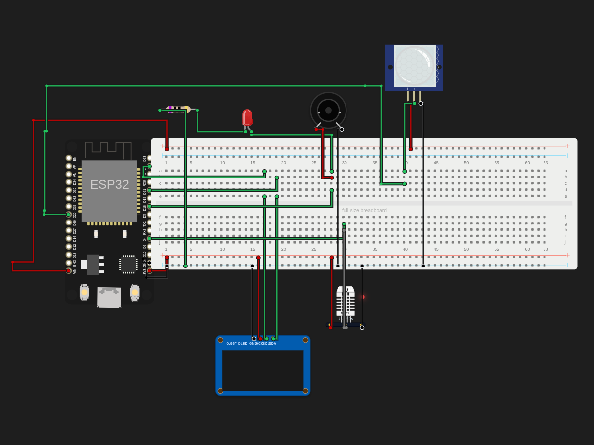

# Desk Info screen + Alarm system!

> Built in [Breadboard](https://breadboard.hackclub.com), a Hack Club program. This project took ~4.1 hours of work.

## What It Does

So this is a small project, my first project with ESP-32 and C++ too! THis is a desk info buddy, which gives you current temperature and humidity info. ALso, this detects any fire and make you notify if someone is coming, especially your parents so you can clean your room asap lol:)

## How It Works

The circuit is captured in `breadboard-project.json`, and the firmware that runs it is in the `firmware/` folder.

## How To Use It

So this is a small project, my first project with ESP-32 and C++ too! THis is a desk info buddy, which gives you current temperature and humidity info. ALso, this detects any fire using the DHT sensor and buzzes the alarm & buzzer  while alarming you through the them + the screen! Also, the PIR sensor make you notify if someone is coming, especially your parents so you can clean your room asap lol:)

## Demo

- **Simulate it live:** [https://breadboard.hackclub.com/share/138](https://breadboard.hackclub.com/share/138), runs the firmware in the Breadboard simulator
- **View the design:** [https://taniwankenobi.github.io/breadboard-plays/p/138/](https://taniwankenobi.github.io/breadboard-plays/p/138/)

## Schematic

The editor snapshot is in `breadboard-project.json`.

## Bill of Materials

| Part | Quantity |
| --- | --- |
| ESP-32 | 1 |
| Breadboard | 1 |
| DHT 11/22 sensor | 1 |
| ~70 ohm resistor | 1 |
| PIR Motion sensor | 1 |
| LED | 1 |
| Buzzer | 1 |
| 0.96'' OLED screen | 1 |

## Firmware

Firmware files are in the `firmware/` folder.

## Build Journal

Build journal entries are kept in [`journals.md`](journals.md).

---

*Made in [Breadboard](https://breadboard.hackclub.com) — 4.1h of work*

